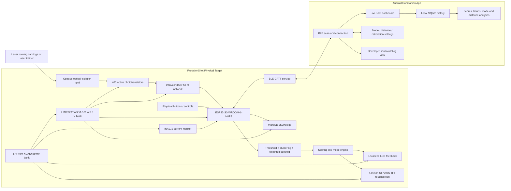

# PrecisionShot Training System - Project Scope

> AI-oriented project reference distilled from the **PrecisionShot Training System Midterm Milestone Report** for UCF EEL 4914 Senior Design I, Group 13.
>
> **Purpose:** Give a developer, reviewer, or AI assistant enough context to understand the complete project without repeatedly reading the full report.
>
> **Scope date:** Summer 2026 midterm design state  
> **Project website:** https://www.precisionshot.xyz/  
> **Course:** EEL 4914 - Senior Design I  
> **Team:** Anthony Fontana, DeLayne Russell, Kenn Pickavance, Nicolas Koteff

---

## 0. How to Use This File

This document is a normalized technical summary, not a verbatim copy of the report.

When a detail in the full report conflicts with another section, use the following order of authority:

1. **Canonical Decisions and Conflict Resolutions** in this file.
2. The latest explicit component-selection paragraph in the report.
3. The demonstrable engineering specification table.
4. Earlier goals, concept text, or diagrams.

Status labels used throughout this file:

- **LOCKED:** Selected design direction or component unless new testing forces a change.
- **PLANNED:** Intended for the prototype but not yet fully implemented or validated.
- **OPTIONAL:** Useful, but not required for the minimum functional prototype.
- **FUTURE:** Deliberately outside the first working prototype.
- **TBD:** Requires a final engineering decision or test result.

The primary project rule is:

> **The physical target is the main product. The mobile app enhances it, but the target must remain functional without a phone, Wi-Fi, cloud service, or internet connection.**

---

## 1. Project Identity

### Project Name

**PrecisionShot Training System**

### One-Sentence Description

PrecisionShot is a portable, rechargeable, laser-based dry-fire target that detects and estimates laser impact location using a dense phototransistor array, provides immediate feedback on the target, and sends shot data over Bluetooth Low Energy to a local mobile app for history and analytics.

### Problem Being Solved

Live-ammunition practice is expensive, requires a suitable range, and interrupts training when users must inspect paper targets. Existing laser training products often have one or more of these limitations:

- They only report hit or miss.
- They require a smartphone camera and precise camera placement.
- They depend on proprietary firearms, cartridges, or accessories.
- They require subscriptions, accounts, cloud services, or internet access.
- They do not provide both a standalone physical target and detailed local analytics.

### Proposed Value

PrecisionShot combines:

- Direct, on-target laser detection.
- Estimated x/y shot location rather than simple hit/miss.
- Immediate physical visual feedback.
- Standalone display and controls.
- BLE connection to a local-only mobile app.
- Local training history and analytics.
- Rechargeable, portable operation.
- A modular design that can be expanded with additional modes and analytics.

---

## 2. Canonical Design Decisions

Use this table as the current source of truth when older report sections disagree.

| Area | Canonical Decision | Status |
|---|---|---|
| Main processor | **ESP32-S3-WROOM-1-N8R8** with 8 MB flash and 8 MB PSRAM | LOCKED |
| Embedded framework | **C++ with ESP-IDF in Visual Studio Code** | LOCKED |
| Phone app | **React Native + Expo + TypeScript**, Android-first prototype | LOCKED |
| Wireless link | **Bluetooth Low Energy**, direct phone-to-target connection | LOCKED |
| Wi-Fi/cloud | Not required for the prototype; no cloud account or internet dependency | LOCKED |
| Sensor count | **400 active phototransistors** | LOCKED |
| Mechanical grid | **28 columns x 20 rows = 560 physical grid cells**, with 400 populated active positions | PLANNED |
| Target capture area | Approximately **14 in high x 10 in wide elliptical active area** | PLANNED |
| Overall board/enclosure | Approximately **20 in high x 14 in wide** | PLANNED |
| Prototype phototransistor | **ALS-PT204-6C/L177** through-hole part for breadboard testing | LOCKED for testing |
| Final SMD phototransistor candidate | **ALS-PT19-315C/L177/TR8** | PLANNED; final approval/testing still needed |
| Analog multiplexer | **CD74HC4067 / 74HC4067**, 16-channel analog MUX | LOCKED unless signal-fidelity testing fails |
| Shot-location algorithm | Thresholding, strongest-sensor/cluster selection, outlier rejection, and weighted centroid | PLANNED |
| Display | **Hosyond 4.0-inch 320x480 capacitive TFT**, ST7796S display driver, FT6336U touch controller | LOCKED |
| Display links | SPI for display; I2C for capacitive touch | LOCKED |
| Main power source | **KUXIU commercial semi-solid-state power bank**, nominal 5 V USB output | LOCKED |
| 3.3 V regulator | **Texas Instruments LMR33620ADDA**, 2 A synchronous buck converter | LOCKED |
| Battery/current monitoring | **INA219** high-side current monitor with firmware-based energy estimation | PLANNED; accuracy must be validated |
| Target-side storage | microSD with JSON logs | PLANNED / medium priority |
| App-side storage | Local SQLite database or equivalent local storage | PLANNED |
| Data format | Event-based JSON packets for the first BLE prototype | LOCKED for initial implementation |
| User profiles | One local profile for the first prototype | LOCKED for prototype |
| Distance tracking | Manual entry on target or app | LOCKED for prototype |
| Automatic distance | Camera/range-sensor method | FUTURE |
| Shot-angle tracking | Not required for the first prototype | FUTURE |

---

## 3. Project Scope

### 3.1 Minimum Functional Prototype

The minimum successful prototype must:

1. Detect a valid laser training shot on the target.
2. Map sensor readings to an estimated physical impact location.
3. Reject normal ambient-light changes well enough for reliable indoor use.
4. Produce local feedback on the target within the required response time.
5. Display shot information, mode, calibration state, and basic system status.
6. Allow operation with physical controls when no phone is connected.
7. Run from a rechargeable commercial battery/power-bank system.
8. Maintain stable 5 V and 3.3 V power rails.
9. Connect to an Android mobile app over BLE.
10. Send processed shot records to the app.
11. Store at least basic local shot history on the phone.
12. Survive repeated demonstration use without frequent resets, false detections, or mechanical misalignment.

### 3.2 Important but Secondary Features

These should be completed after the core detection path is stable:

- Local app analytics.
- microSD device logs.
- Improved display graphics and touch navigation.
- Refined training modes.
- Enclosure polish and cable management.
- Expanded debugging views.
- Longer-term history views.

### 3.3 Explicitly Outside the First Prototype

Do not assume the first prototype includes:

- Cloud accounts or cloud synchronization.
- Firebase or an internet database.
- Required Wi-Fi connectivity.
- Online multiplayer or social features.
- Automatic user identification.
- Automatic distance measurement.
- Camera-based shot detection.
- Automatic shot-angle or posture measurement.
- AI coaching as a required function.
- Fully customizable user-created drills.
- Production-grade manufacturing, certification, or commercial release readiness.

---

## 4. Demonstrable Engineering Requirements

The following values are the report's most defensible test targets. Earlier, more aggressive goals such as 0.1 cm accuracy or 10 ms response should be treated as aspirations, not the current acceptance criteria.

| Requirement | Acceptance Target | Verification Method |
|---|---|---|
| Shot-location accuracy | At least **90% of valid shots within 1.5 cm** of the actual marked impact | Fire at least 30 controlled shots at known locations and compare physical vs. reported position |
| Physical response time | Feedback within **100 ms for at least 95%** of detected shots | Measure sensor event to LED/display response with logic analyzer or oscilloscope |
| Detection reliability | At least **95% of valid shots detected** with no more than one false event in a 10-minute test | Test under dark, normal, and bright indoor lighting at distances up to 10 m |
| Sensor-array coverage | **100% of installed active channels** readable and correctly mapped | Diagnostic mode activates and verifies every sensor ID/coordinate |
| Standalone operation | Detection, scoring, display, mode selection, calibration, and reset work without a phone | Disconnect app and complete a full test session using only target controls |
| BLE connection | Connect within **10 seconds** | Time app scan, selection, and connection |
| BLE shot update | App displays received shot within **1 second** | Fire multiple shots and measure target-to-app update time |
| BLE operating range | Up to **10 m** for the prototype test | Increase phone distance and repeat connection/shot tests |
| App persistence | At least **100 consecutive shot records** remain after app restart | Fire or simulate 100 shots, close/reopen app, compare record count |
| Battery operation | At least **4 hours** of normal operation without resets | Fully charge and run the complete system for four hours |
| Rail stability | 5 V and 3.3 V rails remain within **+/-5%** | Measure at beginning, during peak activity, and at end of battery test |

### Lighting Scope Clarification

The project has a long-term goal of indoor and outdoor usability, but the core report verification procedure is centered on dark, normal, and bright indoor lighting, including near-window conditions. Full sunlight performance must not be claimed until it is physically demonstrated.

---

## 5. System Architecture



### High-Level Data Path

1. A laser pulse reaches the target face.
2. The mechanical grid reduces off-axis ambient light.
3. One or more phototransistors produce analog responses.
4. The MUX network routes selected sensor voltages to ESP32 ADC inputs.
5. Firmware scans sensors and compares readings against calibration thresholds.
6. Firmware identifies valid local clusters and rejects noise/outliers.
7. A weighted centroid estimates the x/y impact point.
8. The active training mode calculates a score and session update.
9. The target updates local LEDs and the TFT.
10. The event is optionally written to microSD.
11. If a phone is connected, the ESP32 sends a BLE shot event.
12. The app displays and stores the record locally.

---

## 6. Hardware Design

## 6.1 Sensor Array

### Functional Goal

The sensor system must estimate where a visible red laser hits the target, not merely determine that some light was detected.

### Layout

- 400 active phototransistors.
- 28 x 20 mechanical grid, totaling 560 possible physical cells.
- 400 cells populated according to an elliptical target map.
- Active target area approximately 14 in x 10 in.
- Overall lower sensor region approximately 14 in x 14 in.
- Upper 6 in of a roughly 20 in x 14 in assembly reserved for control electronics and user interface.

### Zone Distribution

| Zone | Purpose | Active Sensor Count |
|---|---|---:|
| Zone 1 | Bullseye / highest-density center | 146 |
| Zone 2 | Inner ring 1 | 52 |
| Zone 3 | Inner ring 2 | 76 |
| Zone 4 | Outer ring 1 | 66 |
| Zone 5 | Outer rim | 60 |
| **Total** | Elliptical active target | **400** |

The center uses higher sensor density because fine positional accuracy matters most near the bullseye. Density decreases toward the outer region.

### Sensor Components

**Breadboard/testing part:** ALS-PT204-6C/L177

- Through-hole package.
- Spectral response selected for visible red laser testing.
- Useful for prototyping and characterization.

**Final SMD candidate:** ALS-PT19-315C/L177/TR8

- Similar visible-light spectral response.
- Compact SMD form.
- Must be validated for package handling, solderability, availability, optical alignment, and actual red-laser response.

### Ambient-Light Strategy

Ambient rejection uses both hardware and software:

- Opaque grid walls block side and overhead light.
- Recessed sensor wells reduce the optical field of view.
- A global software threshold is used for the first prototype.
- Calibration can be changed from the target or app.
- Nearby sensor clustering distinguishes a laser spot from isolated noise.
- Distant weak readings are rejected as reflections or ambient interference.

Per-sensor calibration is a possible future improvement if component variation makes one global threshold insufficient.

---

## 6.2 Multiplexer Architecture

### Why Multiplexing Is Required

The ESP32-S3 does not have enough dedicated ADC inputs to read 400 analog sensors directly. Analog multiplexers act as digitally controlled switches that route one selected sensor voltage at a time to an ADC input.

### Selected Part

**CD74HC4067 / 74HC4067**

- 16 analog input channels.
- Four binary select lines.
- Low cost and widely documented.
- Fast switching.
- Extensive examples and library support.
- Higher and less-flat on-resistance than more expensive analog MUX options.

### Quantity

A direct one-level design needs approximately:

- `ceil(400 / 16) = 25` 16-channel MUX devices.

The final topology may use bank-enable lines, multiple ADC inputs, or a cascaded second stage. That decision must balance:

- GPIO usage.
- ADC throughput.
- Scan latency.
- Series resistance.
- Signal settling time.
- PCB routing complexity.
- Analog signal distortion.

### Fallback Option

If testing shows the 74HC4067 introduces unacceptable amplitude error or nonlinearity, the team may reconsider a lower-resistance part such as the ADG1606. This is a fallback, not the current selection.

---

## 6.3 Main Processor

### Selected Module

**ESP32-S3-WROOM-1-N8R8**

Key reasons:

- Dual-core 32-bit Xtensa LX7 processor up to 240 MHz.
- 8 MB flash.
- 8 MB PSRAM.
- Bluetooth Low Energy.
- Wi-Fi available for future use, though not required.
- ADC, GPIO, SPI, I2C, UART, PWM, timers, watchdogs, SD/MMC support.
- USB Serial/JTAG for programming and debugging.
- Compatible with a 3.3 V system rail.

### Processor Responsibilities

- Sensor/MUX scanning.
- Calibration and thresholding.
- Shot validation and location calculation.
- Scoring and training modes.
- Local display updates.
- Physical control input.
- BLE GATT communication.
- microSD logging.
- Battery/current telemetry.
- Error-state handling.
- Debug data production.

### Development Stack

- Language: C++.
- Framework: ESP-IDF.
- IDE: Visual Studio Code.
- Programming/debugging: native USB Serial/JTAG where practical.
- Python: optional for offline log analysis, plotting, simulation, and test tooling only.

---

## 6.4 Display and Physical Controls

### Final Display

**Hosyond 4.0-inch 320 x 480 capacitive touchscreen module**

- ST7796S display controller.
- 4-wire SPI display interface.
- FT6336U capacitive-touch controller.
- I2C touch interface.
- Compatible with ESP32-S3.
- Onboard level conversion supports flexible 3.3 V / 5 V integration.

### Display Responsibilities

The target display should show:

- Current mode.
- Latest shot location.
- Score and session totals.
- Manual distance setting.
- Calibration threshold or preset.
- BLE connection state.
- Battery/current estimate.
- Shot count.
- Error and warning messages.

### Physical Inputs

At minimum, target-side interaction must support:

- Mode selection.
- Session reset.
- Calibration adjustment or calibration trigger.
- Distance selection/entry.
- Basic navigation.
- Power on/off.

The report references both buttons and a rotary encoder. The final exact control layout is still a PCB/enclosure integration decision.

---

## 6.5 Local LED Feedback

The design pairs each active sensor cell with a nearby indicator LED or equivalent localized feedback mechanism.

Goals:

- Immediate visual confirmation at the shot location.
- Visibility without requiring the user to look at the TFT or phone.
- Support for persistent-on time, flashing patterns, or mode-specific colors if the driver architecture allows.

Candidate LED:

- Würth 150080VS75000, green 0805 SMD LED.

The feedback system must prevent the LEDs from optically triggering nearby phototransistors. The mechanical cell therefore isolates the LED path from the sensor path.

Two broad drive options were discussed:

1. Direct local hardware drive: fastest, but difficult to control and potentially power-intensive.
2. MCU-controlled LED drivers/shift registers/matrix drivers: more flexible and easier to manage, but adds firmware and driver hardware.

The final LED-driver topology is **TBD**.

---

## 6.6 Power System

### Power Source

**KUXIU commercial semi-solid-state power bank**

- Approximately 5,000 mAh at a nominal internal 3.7 V.
- Approximately 18.5 Wh nominal energy.
- Provides a regulated 5 V output through its integrated electronics.
- Includes manufacturer battery-management protections.
- Avoids designing a raw LiPo charging system into the custom PCB.

### Power Rails

- **5 V rail:** Directly from the power bank for suitable loads such as display and LED hardware.
- **3.3 V rail:** Generated from 5 V by the LMR33620ADDA for the ESP32-S3, sensor array, MUX logic, microSD, and other low-voltage electronics.

### 3.3 V Regulator

**Texas Instruments LMR33620ADDA**

- Synchronous buck converter.
- 3.8 V to 36 V input range.
- Up to 2 A output.
- SO PowerPAD package with exposed leads.
- Easier to inspect/rework than BGA or extremely small leadless alternatives.
- Power Good output available to the ESP32 through a pull-up.
- Includes protection features such as current limiting, thermal shutdown, undervoltage lockout, and soft-start.

### Required Power PCB Features

- Input protection and/or resettable polyfuse.
- 5 V input test point.
- 3.3 V output test point.
- Ground test points.
- Proper inductor, input/output capacitors, and feedback network per TI reference design.
- Thermal pad and thermal vias.
- Decoupling near every major IC and MUX bank.
- Separation of noisy LED/switching paths from analog sensor traces.
- Power Good connection if GPIO budget permits.

### Monitoring

The planned INA219 measures load-side voltage and current. Firmware may integrate current over time to estimate consumed energy.

Important limitation:

> Because the commercial power bank hides its internal cells and state-of-charge algorithm, load-side Coulomb counting is an estimate, not guaranteed access to true battery SOC. The displayed battery percentage must be calibrated and validated before it is described as accurate.

### Runtime Target

The testable minimum is **4 hours**. Longer runtime claims must be measured with the final hardware. The report contains inconsistent peak-power values, so theoretical 8-12 hour claims should not be treated as verified.

---

## 6.7 PCB Architecture

### General Layout

The report proposes a large integrated board or coordinated PCB assembly with:

- Lower high-density sensor/LED area.
- Upper control and user-interface area.
- Sensor MUX banks organized in repeated local modules.
- ESP32-S3 control section.
- 5 V input and 3.3 V buck section.
- Display/touch connectors.
- Physical control connectors.
- microSD interface.
- Debug and test points.
- Mechanical mounting/alignment holes.

### PCB Priorities

1. Mechanical alignment with the front optical grid.
2. Short and symmetric analog sensor traces where practical.
3. Controlled grounding and decoupling.
4. Separation between analog sensing and switching/LED noise.
5. Accessible test points.
6. Clear silkscreen labels and connector orientation.
7. USB/boot/reset access for ESP32 bring-up.
8. Manufacturable component packages.
9. No unnecessarily tiny passives; 0805 is preferred where possible.

### Preliminary Interfaces

| Subsystem | Interface |
|---|---|
| MUX select/address | Digital GPIO |
| MUX enable/bank selection | Digital GPIO / decoder, TBD |
| MUX outputs | ESP32 ADC inputs |
| TFT display | SPI |
| Capacitive touch | I2C |
| microSD | SPI or SD/MMC, final assignment TBD |
| Physical buttons | Digital GPIO, possibly interrupt-capable |
| Battery/current monitor | I2C |
| BLE | Internal ESP32 radio |
| Programming/debug | USB Serial/JTAG |

The final GPIO map must be frozen before the final schematic and PCB layout are approved.

---

## 7. Mechanical and Enclosure Design

## 7.1 Physical Form

Planned overall dimensions:

- Approximately 20 in tall.
- Approximately 14 in wide.
- Active elliptical target approximately 14 in x 10 in.
- Upper 6 in reserved for display, controls, and internal electronics.

The enclosure must be:

- Portable.
- Rigid enough to preserve sensor-to-grid alignment.
- Serviceable from the rear.
- Suitable for wall or tabletop use.
- Opaque around the sensor grid.
- Ventilated enough to avoid heat buildup.
- Able to secure the power bank and prevent movement.

## 7.2 Optical Grid

The front grid is both a structural component and an optical filter.

Planned geometry includes:

- 28 x 20 cell matrix.
- Approximately 10.5 mm x 10.5 mm per cell.
- Inward-sloped walls forming chamfered funnels.
- Central aperture shelf aligned to each active phototransistor.
- Dedicated recessed LED tunnel separated from the sensor.
- Opaque dark print material to prevent internal light bleed.
- Alignment pins or holes to register the grid to the PCB.

The exact dimensions cited in the report vary between sections and must be reconciled with the final selected phototransistor package and actual PCB footprint.

## 7.3 Serviceability

Rear-panel access should expose:

- Back of PCB/test points.
- Power-bank bracket.
- Internal cables.
- USB-C charging access.
- ESP32 programming/debug connection.

The front grid and optical alignment should remain undisturbed during normal service.

## 7.4 Mounting

Planned mounting methods:

- Reinforced rear keyhole slots for wall mounting.
- Broad base or feet for tabletop use.
- Nylon standoffs for PCB alignment.
- Brass heat-set inserts for repeated enclosure disassembly.
- Internal ribs to reduce warping and component movement.

---

## 8. Embedded Firmware Design

## 8.1 Device-First Architecture

The ESP32 is authoritative for the live system state. The phone mirrors and modifies state when connected, but it is not required for shot detection or scoring.

### Core System States

Suggested state model based on the report:

- `BOOT`
- `INITIALIZING`
- `READY`
- `CALIBRATING`
- `ARMED` or `WAITING_FOR_SHOT`
- `PROCESSING_SHOT`
- `DISPLAYING_RESULT`
- `BLE_CONNECTED`
- `DEBUG_MODE`
- `LOW_BATTERY`
- `ERROR_RECOVERABLE`
- `ERROR_FATAL`

BLE connection should be represented as a parallel status or sub-state, not something that blocks the target's main operation.

## 8.2 Startup Sequence

1. Initialize power-good and fault inputs.
2. Initialize USB/UART debug logging.
3. Initialize GPIO and physical controls.
4. Initialize I2C devices.
5. Initialize TFT and touch.
6. Initialize ADC and MUX control lines.
7. Load default or stored calibration/settings.
8. Initialize microSD if installed.
9. Initialize BLE advertising/GATT services.
10. Perform sensor baseline scan or prompt for calibration.
11. Enter ready state.

## 8.3 Sensor Scan and Shot-Detection Pipeline

```text
repeat continuously:
    scan selected MUX banks/channels
    read ADC values after required settling time
    subtract or compare against ambient baseline
    collect channels above threshold

    if no valid candidate:
        remain armed

    if candidates exist:
        locate strongest reading
        collect spatially nearby candidates into primary cluster
        reject distant weak readings
        detect a second distant strong cluster

        if multiple strong clusters are present:
            reject event as possible simultaneous/multiple shot
            show recoverable error
        else:
            compute weighted centroid from cluster
            map centroid to target coordinates and score zone
            apply active mode rules
            update local LED/display
            write optional device log
            send BLE event if connected
            apply shot debounce/holdoff
```

### Weighted Centroid

For sensors `i` in the accepted local cluster:

```text
x_hit = sum(x_i * weight_i) / sum(weight_i)
y_hit = sum(y_i * weight_i) / sum(weight_i)
```

Possible weights:

- Raw ADC value above baseline.
- ADC value minus threshold.
- Nonlinear weight emphasizing the strongest sensor.

The exact weighting function must be tuned with controlled physical testing.

### Important Timing Concerns

- MUX channel settling time.
- ADC acquisition time.
- Full-array scan time.
- Laser pulse duration.
- Firmware task scheduling.
- LED/display update latency.
- BLE notification latency.

The system must not scan so slowly that a short laser pulse occurs entirely between reads. The scan strategy may require parallel MUX outputs, sample/hold behavior, analog filtering, latching, or another hardware aid if direct sequential scanning cannot reliably capture the pulse.

This is one of the project's highest technical risks.

## 8.4 Calibration

First-prototype calibration uses a single global threshold or global baseline adjustment.

User controls should support:

- Manual calibration trigger.
- Threshold increase/decrease.
- Optional presets: dark, normal, bright, custom.
- Immediate display of current threshold/state.
- BLE command to update the same setting.

A calibration routine may:

1. Prevent shot processing temporarily.
2. Scan all sensors under ambient conditions.
3. Calculate average, maximum, or percentile baseline.
4. Add a safety margin.
5. Store the resulting global threshold.
6. Return to ready state.

## 8.5 Training Modes

### Freestyle

- Unlimited informal shots.
- Show each shot position and score.
- Minimal session rules.

### Classic

- Traditional center-based score.
- Likely fixed shot count, such as ten shots.
- Track total and average score.

### Rapid

- Emphasize speed and accuracy.
- May activate a smaller target region.
- May track reaction/acquisition time.

### Moving Target

- Planned advanced mode.
- Move or change the active target region using the LED/display system.
- Should not delay completion of Freestyle and Classic.

### Mode Rules

All modes reuse the same detection pipeline. Mode-specific code changes:

- Scoring.
- Active target zone.
- Shot count/session termination.
- Timing.
- Display information.
- Data fields sent to the app.

## 8.6 Error Handling

Recoverable errors include:

- Multiple strong shot clusters.
- Invalid or saturated sensor readings.
- BLE disconnect.
- microSD failure.
- Calibration out of range.
- Low battery warning.
- Invalid mode or command.
- Missing optional peripheral.

The target should keep operating whenever the failed subsystem is not essential. For example:

- BLE failure must not stop local shot detection.
- microSD failure must not stop local display feedback.
- App disconnection must not reset the session.

## 8.7 Logging

### Normal Log Fields

- Timestamp.
- Shot number.
- x/y position.
- Score.
- Mode.
- Distance and unit.
- Calibration threshold.
- Battery/current estimate.
- BLE connection status.

### Debug Log Fields

- Active sensor IDs.
- Raw ADC values.
- Baseline-corrected values.
- Threshold.
- Primary cluster membership.
- Rejected outliers.
- MUX bank/channel.
- Scan duration.
- Processing duration.
- Firmware state.
- Error code.

Full-array dumps should only occur on demand because they are too large for routine BLE traffic.

---

## 9. BLE Communication

## 9.1 Connection Model

- ESP32 advertises as a PrecisionShot device.
- Android app scans and lists nearby compatible targets.
- One active phone connection for the first prototype.
- App requests current state after connecting or reconnecting.
- Target continues normally through disconnects.

## 9.2 Event-Based Protocol

The target should send data only when useful events occur:

- Shot detected.
- Mode changed.
- Distance changed.
- Calibration changed.
- Session reset.
- Battery/status update.
- Error raised or cleared.
- Debug response requested.

## 9.3 Example Shot Packet

```json
{
  "type": "shot",
  "protocolVersion": 1,
  "shotId": 42,
  "timestampMs": 1784222400000,
  "position": {
    "xMm": 12.4,
    "yMm": -8.7
  },
  "score": 9,
  "zone": 2,
  "mode": "classic",
  "distance": {
    "value": 7.0,
    "unit": "m"
  },
  "calibrationThreshold": 1830,
  "batteryPercentEstimate": 72,
  "processingTimeUs": 18450
}
```

This is a recommended normalized representation based on the report. Exact field names are not yet frozen.

## 9.4 Example State Packet

```json
{
  "type": "state",
  "protocolVersion": 1,
  "mode": "freestyle",
  "distance": {
    "value": 15,
    "unit": "ft"
  },
  "calibrationThreshold": 1830,
  "debugEnabled": false,
  "shotCount": 0,
  "scoreTotal": 0,
  "batteryPercentEstimate": 72,
  "storageAvailable": true
}
```

## 9.5 Example Command Packet

```json
{
  "type": "command",
  "protocolVersion": 1,
  "command": "setCalibrationThreshold",
  "value": 1900
}
```

Other likely commands:

- `setMode`
- `setDistance`
- `setDistanceUnit`
- `resetSession`
- `startCalibration`
- `setDebugEnabled`
- `requestState`
- `requestSensorSnapshot`

### Protocol Note

The first implementation favors readable JSON over bandwidth efficiency. If MTU, fragmentation, or latency becomes a problem, migrate high-volume debug data to a compact binary format while keeping the logical event model.

---

## 10. Mobile Application

## 10.1 Technology

- React Native.
- Expo.
- TypeScript.
- Android-first prototype.
- Direct BLE communication.
- Local-only storage.
- No login required.
- No internet required.

## 10.2 Main Screens/Features

### Connection Screen

- Scan for PrecisionShot targets.
- Show device name and connection state.
- Connect/disconnect.
- Recover after a lost connection.

### Live Dashboard

- Current mode.
- Latest shot plot.
- Latest score.
- Shot count and session total.
- Distance.
- Calibration value.
- Battery estimate.
- BLE state.

### History

- Local shot records.
- Grouped primarily by date for the prototype.
- View shot location, score, mode, distance, and timestamp.
- Persist after app restart.

### Analytics

- Average score.
- Shot count.
- Score/accuracy trend over time.
- Performance by mode.
- Performance by distance.
- Shot grouping/consistency metrics where practical.

### Settings/Remote Control

- Change mode.
- Set distance.
- Change unit between feet/meters or inches/centimeters where applicable.
- Adjust calibration threshold or preset.
- Reset session.
- Enable debug mode.

### Developer/Debug View

- Active sensor IDs.
- Threshold values.
- Raw or filtered readings.
- Sensor grid visualization.
- Packet/debug log.
- Processing timing.

## 10.3 Local Database

Likely implementation: SQLite.

Suggested shot record fields:

| Field | Type | Meaning |
|---|---|---|
| `id` | integer/text | Unique local shot ID |
| `deviceId` | text | Target identifier |
| `timestamp` | integer | Event time |
| `mode` | text | Freestyle, Classic, Rapid, etc. |
| `score` | integer/real | Calculated score |
| `xMm` | real | Horizontal impact coordinate |
| `yMm` | real | Vertical impact coordinate |
| `zone` | integer | Target scoring zone |
| `distanceValue` | real | Manual distance |
| `distanceUnit` | text | ft or m |
| `calibrationThreshold` | integer/real | Active threshold |
| `batteryEstimate` | real | Target estimate at shot time |
| `sessionId` | nullable | Optional future formal session grouping |

The prototype can group by date even if `sessionId` is not implemented.

## 10.4 Authority and Synchronization

- Target is authoritative for active device state.
- App sends commands, then updates from returned state/event packets.
- On reconnect, app requests a fresh state snapshot.
- Existing app history remains viewable while disconnected.
- The app does not attempt to reconstruct missed device events unless a later log-sync feature is implemented.

---

## 11. Primary User Flows

## 11.1 Standalone Training

1. User powers on the target.
2. Target initializes and shows ready status.
3. User selects mode using target controls.
4. User sets distance and calibrates for current lighting.
5. User fires a laser training shot.
6. Target detects and scores the shot.
7. Local LED/TFT shows the result.
8. Target stores an optional device log.
9. User continues without any phone connection.

## 11.2 App-Connected Training

1. User powers on the target.
2. User opens the mobile app.
3. App scans and connects over BLE.
4. App requests current target state.
5. User changes mode, distance, or calibration from the app or target.
6. Target remains authoritative and broadcasts updated state.
7. User fires a shot.
8. Target processes locally first.
9. Target updates local feedback.
10. Target sends a shot event to the app.
11. App displays and stores the shot.
12. Analytics update from local history.

## 11.3 Calibration Flow

1. User places target in intended lighting.
2. User triggers calibration from button/touch/app.
3. Firmware scans ambient sensor values without a shot.
4. Firmware chooses or adjusts a global threshold.
5. User may fine-tune it manually.
6. System returns to ready state.
7. Calibration value is shown on both target and app.

## 11.4 BLE Disconnect Flow

1. Connection is lost.
2. App marks target disconnected.
3. Target continues detecting, scoring, displaying, and optionally logging.
4. App can still display existing local history.
5. On reconnect, app requests current target state.

---

## 12. Testing Strategy

## 12.1 Incremental Bring-Up Order

1. Verify power-bank 5 V output.
2. Build and test LMR33620ADDA 3.3 V regulator.
3. Verify ESP32 boot, USB programming, and debug output.
4. Test one phototransistor directly with ADC.
5. Test several sensors and characterize ambient vs. laser readings.
6. Test one 74HC4067 with a small sensor group.
7. Measure MUX settling and scan speed.
8. Build a reduced sensor grid.
9. Implement threshold and shot-candidate detection.
10. Implement weighted centroid and mapping.
11. Test LED feedback and power draw.
12. Bring up TFT/touch and physical controls.
13. Implement BLE state and shot packets.
14. Connect mobile app and persist data.
15. Integrate microSD logging.
16. Assemble first PCB revision.
17. Integrate enclosure/grid.
18. Run full validation matrix.

## 12.2 Sensor Tests

- Dark-room baseline.
- Typical indoor light.
- Bright indoor light.
- Near-window/direct ambient challenge.
- Multiple distances up to 10 m.
- Different laser strengths/cartridges if available.
- Center and edge positions.
- Hits between sensors.
- Repeated shots at same point.
- Rapid consecutive shots.
- Reflection/noise tests.
- LED-on optical interference test.

## 12.3 Algorithm Tests

- Strong single-sensor hit.
- Multi-sensor local cluster.
- Weak distant outlier.
- Two distant strong clusters.
- ADC saturation.
- Threshold too low.
- Threshold too high.
- Sensor missing or stuck.
- MUX address mismatch.
- Coordinate mapping correctness.

## 12.4 Power Tests

- 5 V and 3.3 V at idle.
- During TFT backlight activity.
- During BLE connection and transmission.
- During full sensor scan.
- During LED feedback.
- Combined peak load.
- Four-hour runtime test.
- Thermal inspection of buck, ESP32, and enclosure.
- Recovery from power cycling.

## 12.5 Wireless/App Tests

- Connection under 10 seconds.
- Live event under 1 second.
- Reconnect after leaving range.
- Target behavior while disconnected.
- 100-shot persistence test.
- Malformed packet handling.
- Duplicate packet handling.
- App restart while target remains powered.
- State synchronization after reconnect.

## 12.6 Mechanical Tests

- Grid-to-sensor alignment.
- Enclosure warping.
- Rear-panel service access.
- Wall mount and tabletop stability.
- Power-bank retention.
- USB-C cable access.
- Ventilation and temperature.
- Repeated assembly/disassembly.

---

## 13. Project Priorities

### High Priority

- Sensor characterization.
- MUX scanning.
- ESP32 firmware.
- 3.3 V regulator and power stability.
- PCB schematic and layout.
- Shot detection and location estimation.
- Display/local feedback.
- Physical controls.
- BLE communication.
- Calibration.
- Enclosure alignment.
- Full integration and demonstration reliability.

### Medium Priority

- Local app history.
- App analytics.
- microSD logging.
- Improved target/app UI.
- Enclosure refinement.
- Expanded debug tooling.
- Additional training-mode refinement.

### Low Priority / Stretch

- Automatic distance tracking.
- Shot-angle tracking.
- Advanced coaching.
- Custom user-created drills.
- Cloud backup.
- Multiple user profiles.
- Additional app visualization polish.

---

## 14. Team Responsibilities

| Team Member | Role | Primary Responsibilities |
|---|---|---|
| **DeLayne Russell** | Team Lead and Software Lead | Embedded architecture, shot detection, scoring, calibration, BLE/data flow, display output, mobile app, history, analytics, system logic, deadline/task coordination |
| **Anthony Fontana** | Hardware Lead | Phototransistor array, MUX integration, PCB planning, power design, voltage regulation, signal routing, connections between sensors/ESP32/display/buttons/battery |
| **Kenn Pickavance** | Specifications and Research Lead | Goals/objectives, engineering specifications, product and component research, standards, technical references, validation planning |
| **Nicolas Koteff** | Prototype and Enclosure Lead | Physical layout, enclosure, grid/light isolation, sensor openings, mounting, display/button placement, ventilation, battery access, overall mechanical structure |

All members remain jointly responsible for integration, review, testing, documentation, and final demonstration.

---

## 15. Budget and Commercial Context

### Prototype Budget

The report estimates approximately **$670** for the first working prototype, including:

- 400 phototransistors.
- Custom PCB/stencil work.
- MUX and LED driver hardware.
- ESP32 control hardware.
- TFT display and controls.
- Power bank and regulation.
- Connectors, passives, and wiring.
- 3D-printed enclosure materials.
- Shipping, taxes, replacements, and prototype mistakes.

The budget table contains several arithmetic and unit-price inconsistencies. Treat $670 as a planning envelope, not a finalized BOM total.

### Primary Cost Risks

- PCB respins.
- Sensor quantity or part changes.
- Enclosure revisions.
- Shipping and lead time.
- Damaged components or soldering mistakes.
- Need for lower-resistance MUX components.
- Large-board fabrication constraints.

### Production Estimate

The report provides a preliminary manufacturing estimate of roughly **$110-$170 per unit** at production scale, with a speculative retail range of **$599-$799** to cover R&D, support, marketing, fulfillment, fees, warranties, and future development.

These figures are conceptual only and do not represent a validated business plan, supplier quote, certification cost, or finalized design-for-manufacture analysis.

---

## 16. Current State Represented by the Midterm Report

### Completed or Substantially Defined

- Project concept and goals.
- Core architecture.
- Team roles.
- Engineering specification framework.
- House of Quality.
- ESP32-S3 selection.
- MUX selection.
- Through-hole sensor test selection.
- SMD sensor candidate.
- 4.0-inch TFT selection.
- Power-bank strategy.
- LMR33620ADDA regulator selection.
- Firmware architecture and shot-detection concept.
- BLE/app architecture.
- Enclosure and optical-grid concept.
- Budget and milestone plan.
- Early mobile-app interface demonstration.

### Not Yet Proven in the Report

- Full 400-sensor PCB.
- Final MUX topology and scan rate.
- Reliable capture of short laser pulses across all channels.
- Final sensor package approval.
- Final LED driver architecture.
- Final GPIO allocation.
- Final PCB layout and fabrication.
- Complete enclosure fit.
- Validated weighted-centroid accuracy.
- Validated bright-light/outdoor behavior.
- Validated BLE protocol on final firmware.
- Four-hour integrated runtime.
- Verified battery percentage accuracy.
- Full mode implementation.
- Final end-to-end demonstration.

---

## 17. Known Conflicts, Risks, and Open Decisions

An AI or developer should not silently choose among these conflicts. Resolve them through testing or an explicit team decision.

## 17.1 Report Conflicts to Normalize

### Display Size

- Final selection section specifies a **4.0-inch ST7796S capacitive TFT**.
- Later enclosure text still refers to a **5.0-inch TFT** and 5-inch cutout.
- **Canonical decision:** 4.0-inch module. Mechanical CAD must use the exact purchased module dimensions, not old 5-inch dimensions.

### Sensor Package Naming

- Through-hole test part: ALS-PT204-6C/L177.
- SMD candidate: ALS-PT19-315C/L177/TR8.
- Some enclosure text incorrectly mixes the through-hole part name with a 0603 SMD footprint.
- **Action:** Freeze the exact final SMD footprint from its datasheet before CAD/PCB alignment.

### Accuracy Requirement

- Early objective says 0.1 cm.
- Demonstrable specification says 90% within 1.5 cm.
- **Canonical acceptance target:** 1.5 cm; 0.1 cm is aspirational.

### Response Requirement

- Early objective says 10 ms.
- Demonstrable specification says physical feedback within 100 ms for 95% of shots.
- **Canonical acceptance target:** 100 ms; faster is better.

### Battery Runtime

- Demonstrable target: 4 hours.
- Narrative claims approximately 8.62 hours worst-case and over 12 hours typical.
- Power table lists a different total load that would imply a shorter runtime.
- **Canonical acceptance target:** 4 measured hours. Do not publish longer claims without final test data.

### Indoor vs. Outdoor Scope

- Early goals claim indoor and outdoor use.
- Later specification language focuses on indoor conditions.
- **Canonical prototype scope:** reliable indoor use under varied brightness, with outdoor/strong daylight treated as an extended validation goal.

### PCB vs. Multi-Board Implementation

- Report often describes one large main PCB.
- Cost, routing, assembly, and repairability may favor modular sensor boards plus a control board.
- **Decision still open:** integrated large PCB or tiled/modular PCB architecture.

## 17.2 Highest Technical Risks

1. **Capturing a short laser pulse while scanning 400 multiplexed analog channels.**
2. **Ambient-light rejection without missing valid distant shots.**
3. **MUX on-resistance, settling, ADC noise, and channel-to-channel variation.**
4. **Large-board routing and fabrication cost.**
5. **Mechanical alignment between 400 sensors and the optical grid.**
6. **LED feedback optically interfering with sensors.**
7. **Peak current and power-bank behavior under combined display, BLE, scan, and LED loads.**
8. **BLE support in Expo potentially requiring a development build/native configuration rather than Expo Go.**
9. **Battery SOC estimation from only load-side current measurements.**
10. **Scope pressure from too many modes and analytics before core detection is reliable.**

## 17.3 Required Near-Term Decisions

- Final sensor package and footprint.
- Number of parallel ADC/MUX output paths.
- Cascaded vs. single-stage MUX topology.
- Laser pulse capture strategy and required scan rate.
- LED driver architecture.
- Exact GPIO allocation.
- microSD bus selection and priority.
- Final physical controls.
- Single large PCB vs. modular/tiled boards.
- Exact optical cell dimensions based on purchased parts.
- Battery monitor expectations and user-facing wording.
- BLE service/characteristic and packet schema.

---

## 18. Recommended AI Working Rules

When using this file as context, an AI assistant should:

1. Preserve the device-first architecture.
2. Never make the mobile app, internet, cloud, or Wi-Fi mandatory for core operation.
3. Treat the 4.0-inch ST7796S display as the selected display.
4. Treat the LMR33620ADDA as the selected 3.3 V regulator.
5. Treat the CD74HC4067 as the selected initial MUX.
6. Distinguish the through-hole test phototransistor from the final SMD candidate.
7. Use 400 active sensors and 560 mechanical grid cells unless the team explicitly changes the layout.
8. Prioritize a small-scale sensor/MUX prototype before designing the full array.
9. Avoid claiming untested accuracy, outdoor performance, battery life, or SOC precision.
10. Mark recommendations that are not already report decisions as recommendations.
11. Flag contradictions instead of silently resolving them.
12. Keep high-priority detection, power, PCB, and integration work ahead of app polish or stretch modes.
13. Keep normal BLE packets small; reserve raw sensor data for debug requests.
14. Ensure target behavior remains safe and useful through BLE or microSD failure.
15. Design all firmware modules so sensor scanning, scoring, UI, BLE, and logging can be tested independently.

---

## 19. Suggested Work Breakdown for Implementation

### Phase A - Electrical Proof of Concept

- Characterize one sensor with the real training laser.
- Measure pulse duration and ADC response.
- Test ambient-light baselines.
- Validate one 74HC4067 with multiple sensors.
- Measure full channel-switching and settling timing.
- Determine the number of parallel ADC paths required.

### Phase B - Core Firmware

- Build hardware abstraction for MUX banks and sensors.
- Create sensor-ID-to-coordinate map.
- Implement continuous scan buffer.
- Implement thresholding and cluster extraction.
- Implement weighted centroid.
- Add diagnostic serial output and timing metrics.

### Phase C - Power and UI

- Build LMR33620ADDA regulator section.
- Validate rails under load.
- Bring up ST7796S display and FT6336U touch.
- Implement basic on-target menu and shot plot.
- Add physical button handling.

### Phase D - BLE and App

- Freeze event/command schema.
- Implement BLE GATT service.
- Build connection and state synchronization.
- Send simulated shot packets first.
- Store shots locally.
- Add live dashboard and history.

### Phase E - Reduced Integrated Prototype

- Build a small sensor grid with local LEDs.
- Integrate real shot detection, display, BLE, and app.
- Validate accuracy and latency.
- Tune thresholds and algorithm.

### Phase F - Full PCB and Enclosure

- Freeze components and GPIO.
- Finalize schematic and layout.
- Align PCB with grid CAD.
- Fabricate and assemble.
- Bring up subsystem-by-subsystem.

### Phase G - Validation and Demonstration

- Run controlled accuracy matrix.
- Run lighting matrix.
- Run BLE latency/range tests.
- Run four-hour power test.
- Run reliability sessions.
- Record final evidence and update report.

---

## 20. Glossary

| Term | Meaning in This Project |
|---|---|
| ADC | Analog-to-digital converter used to read phototransistor voltages |
| BLE | Bluetooth Low Energy link between target and phone |
| Cell | One mechanical grid position; may contain a sensor and LED |
| Cluster | Spatially nearby sensors activated by one laser shot |
| ESP-IDF | Espressif's official development framework for ESP32 firmware |
| GATT | BLE data model of services, characteristics, notifications, and writes |
| Global threshold | One detection cutoff applied to all sensors in the first prototype |
| MUX | Analog multiplexer that routes one of many sensor channels to an ADC |
| Optical grid | Opaque mechanical faceplate that limits off-axis ambient light |
| Power Good | Regulator output indicating the 3.3 V rail is within regulation |
| PSRAM | External RAM included in the selected ESP32-S3 module |
| Shot candidate | Sensor reading or cluster that may represent a real laser impact |
| Weighted centroid | Impact estimate calculated from sensor positions weighted by signal strength |

---

## 21. Source and Provenance

This file was created from:

- **PrecisionShot Training System - Midterm Milestone Report**
- EEL 4914 Senior Design I, Group 13
- University of Central Florida
- Summer 2026

The full report remains the detailed source for background discussion, comparison tables, figures, references, budget narrative, and course documentation. This file intentionally removes repeated prose and highlights implementation-relevant decisions, constraints, conflicts, and open questions.
